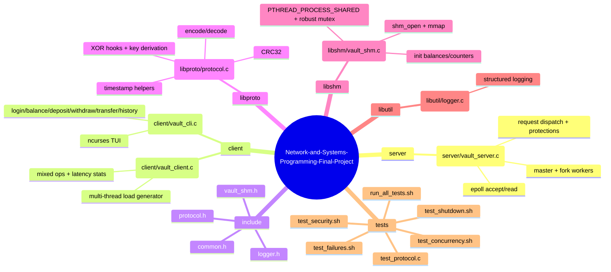

# Bank Vault — Project Architecture (Mermaid)

本檔案提供「整個專案」的架構圖（可直接在 GitHub/Markdown 預覽 Mermaid）。

---

## 1) 全系統總覽（Components + Dependencies）

```mermaid
flowchart LR
  %% ===== External Users =====
  U1([User])
  U2([Load / Tester])

  %% ===== Binaries =====
  subgraph BIN[Build Artifacts and Binaries]
    VS["vault_server - server/vault_server.c"]
    VC["vault_client - client/vault_client.c (load generator)"]
    VCLI["vault_cli - client/vault_cli.c (interactive ncurses TUI)"]
    TP["test_protocol - tests/test_protocol.c"]
  end

  %% ===== Libraries (source modules) =====
  subgraph LIB[Shared Libraries (compiled objects)]
    P["libproto - libproto/protocol.c (encode/decode, CRC32, XOR, timestamp)"]
    S["libshm - libshm/vault_shm.c (POSIX shm init/helpers, robust mutex)"]
    L["libutil - libutil/logger.c (structured logger)"]
    H["include - common.h, protocol.h, vault_shm.h, logger.h"]
  end

  %% ===== Server internals / OS =====
  subgraph OS[OS Facilities (Linux or WSL)]
    TCP[(TCP Socket)]
    EP[epoll]
    SHM[(POSIX Shared Memory: /dev/shm/vault_shm)]
    PM[pthread process-shared mutex]
    SIG[Signals: SIGINT/SIGTERM]
  end

  %% ===== Tests =====
  subgraph T[Integration Tests (shell scripts)]
    R[tests/run_all_tests.sh]
    F[tests/test_failures.sh]
    C[tests/test_concurrency.sh]
    SE[tests/test_security.sh]
    SD[tests/test_shutdown.sh]
  end

  %% ===== Flows =====
  U1 -->|interact| VCLI
  U2 -->|generate traffic| VC
  VCLI -->|Binary Protocol over TCP| TCP --> VS
  VC -->|Binary Protocol over TCP| TCP

  VS --> EP
  VS --> SIG
  VS --> SHM --> PM

  VS --- P
  VS --- S
  VS --- L
  VC --- P
  VCLI --- P
  TP --- P

  P --- H
  S --- H
  L --- H

  R --> TP
  R --> F
  R --> SD
  R --> C
  R --> SE
  F -->|blackbox| VS
  SD -->|signal/cleanup| VS
  C -->|stress| VC
  SE -->|fuzz/bad packets| VS
```

---

## 2) Server 架構（Master + Workers + Shared State）

```mermaid
flowchart TB
  subgraph MASTER[Master Process]
    A["Parse args: port/workers/log-level/log-file"]
    B["Init shared memory: vault_shm_init(create=1)"]
    C["Create listen socket: bind/listen"]
    D[fork() workers]
    E["Signal handler: SIGINT/SIGTERM"]
    F["Set shutdown_flag in shared memory"]
    G["kill + waitpid workers; cleanup shm; close fd"]
  end

  subgraph WORKERS[Worker Processes (N)]
    W1[epoll_wait loop]
    W2[accept() new connections]
    W3["per-connection session_t (rate limiter, login state, read buffer, malformed count)"]
    W4[read() -> process_read_buffer()]
    W5["proto_decode + CRC check (+ optional XOR decrypt)"]
    W6["process_request(): rate-limit + timestamp window + auth"]
    W7["handle_* business ops: balance/deposit/withdraw/transfer"]
    W8[proto_encode -> write() response]
    W9[idle timeout + stats logging]
  end

  SHM[(POSIX shared memory: vault_shm_t)]
  ACCT[(accounts[ ]: mutex + balance_cents)]
  CNT[(global counters: requests/errors/active_conn/shutdown_flag/session_id)]

  A --> B --> C --> D --> W1
  E --> F --> G

  SHM --> ACCT
  SHM --> CNT

  W6 <--> SHM
  W7 <--> ACCT
  W2 --> W3 --> W4 --> W5 --> W6 --> W7 --> W8 --> W9 --> W1
```

---

## 3) 單次請求的資料流（Length-Prefixed Frame + CRC + Dispatch）

```mermaid
sequenceDiagram
  autonumber
  participant Client as Client (vault_cli / vault_client)
  participant TCP as TCP Connection
  participant Worker as Server Worker (epoll)
  participant Proto as libproto (encode/decode)
  participant Shm as Shared Memory (vault_shm_t)

  Client->>Proto: proto_encode(frame_t)
  Proto-->>Client: wire buffer [Len|Magic|Ver|Flags|Op|Seq|Timestamp|CRC|Body]
  Client->>TCP: write(buffer)
  TCP->>Worker: EPOLLIN; read() into session read_buf

  Worker->>Worker: process_read_buffer() (read length, cut full frame)
  Worker->>Proto: proto_decode(buf) check Magic/Ver/CRC
  alt FLAG_ENCRYPTED && logged_in
    Worker->>Proto: proto_xor_crypt(body, session_key)
  end
  Worker->>Worker: process_request() rate limit + timestamp window + auth
  Worker->>Shm: lock + read/update (accounts/counters/session_id)
  Worker->>Proto: proto_encode(response)
  Worker->>TCP: write(response buffer)
  TCP-->>Client: response bytes
  Client->>Proto: proto_decode(response)
  Proto-->>Client: frame_t + status
```

---

## 4) Source Tree（模組責任摘要）




