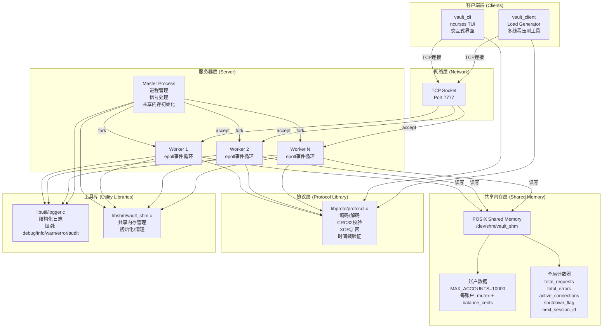
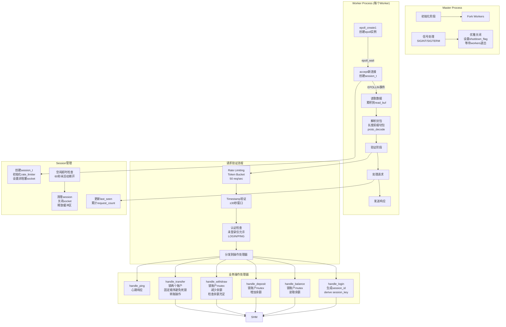
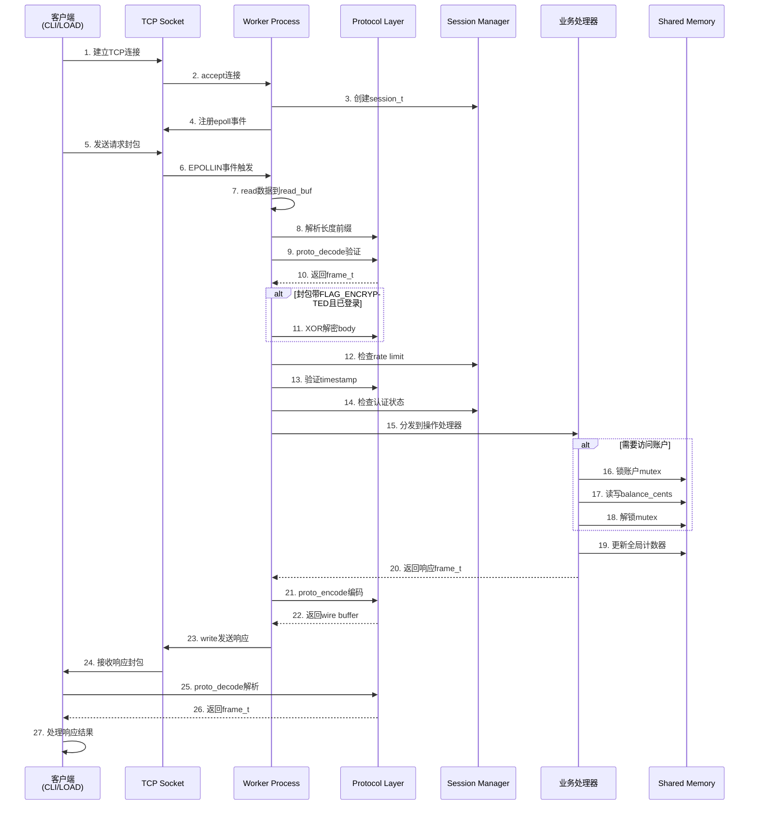
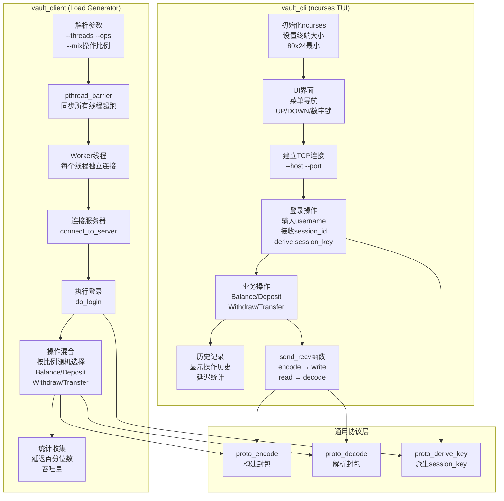
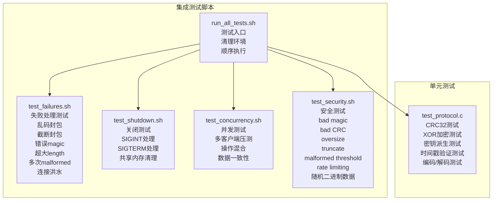
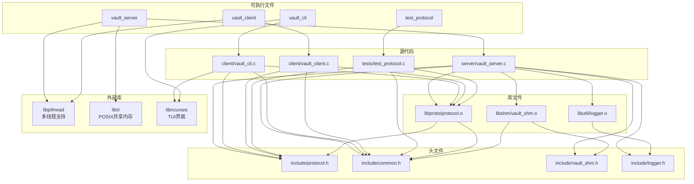

# Bank Vault 项目架构图

本文档提供 Bank Vault 系统的完整架构图和组件说明。

## 系统整体架构



## 服务器内部架构



## 协议层架构

```mermaid
graph LR
    subgraph "Frame抽象层"
        FRAME[frame_t结构<br/>flags/opcode/seq<br/>timestamp_ms/body/body_len]
    end
    
    subgraph "编码流程 (proto_encode)"
        ENCODE1[分配缓冲区<br/>total = HEADER_SIZE + body_len]
        ENCODE2[写入Header<br/>Len/Magic/Ver/Flags<br/>Op/Seq/Timestamp]
        ENCODE3[写入Body]
        ENCODE4[计算CRC32<br/>覆盖整个封包]
        ENCODE5[写入CRC字段<br/>offset 22]
        
        ENCODE1 --> ENCODE2
        ENCODE2 --> ENCODE3
        ENCODE3 --> ENCODE4
        ENCODE4 --> ENCODE5
    end
    
    subgraph "解码流程 (proto_decode)"
        DECODE1[读取长度字段<br/>验证pkt_len == len]
        DECODE2[验证Magic<br/>0xC0DE]
        DECODE3[验证Version<br/>1]
        DECODE4[提取CRC<br/>保存并清零]
        DECODE5[重新计算CRC<br/>与接收值比较]
        DECODE6[解析字段<br/>flags/opcode/seq/timestamp]
        DECODE7[提取Body]
        
        DECODE1 --> DECODE2
        DECODE2 --> DECODE3
        DECODE3 --> DECODE4
        DECODE4 --> DECODE5
        DECODE5 --> DECODE6
        DECODE6 --> DECODE7
    end
    
    subgraph "安全特性"
        CRC[CRC32完整性校验<br/>检测数据损坏/篡改]
        XOR[XOR加密/解密<br/>session_key派生<br/>username + session_id]
        TS_VALID[时间戳验证<br/>防重放攻击<br/>±30秒窗口]
        KEY_DERIVE[密钥派生<br/>proto_derive_key<br/>CRC32(username+session_id)]
        
        KEY_DERIVE --> XOR
    end
    
    FRAME --> ENCODE1
    DECODE7 --> FRAME
    
    ENCODE4 --> CRC
    DECODE5 --> CRC
    
    XOR --> ENCODE3
    XOR --> DECODE7
    
    TS_VALID --> DECODE6
```

## 共享内存架构

```mermaid
graph TB
    subgraph "POSIX Shared Memory"
        SHM_NAME["/vault_shm<br/>/dev/shm/vault_shm"]
    end
    
    subgraph "vault_shm_t结构"
        GLOBAL_LOCK[global_lock<br/>pthread_mutex_t<br/>PTHREAD_PROCESS_SHARED<br/>PTHREAD_MUTEX_ROBUST]
        
        GLOBAL_COUNTERS[全局计数器区]
        TOTAL_REQ[total_requests<br/>uint64_t]
        TOTAL_ERR[total_errors<br/>uint64_t]
        ACTIVE_CONN[active_connections<br/>uint32_t]
        SHUTDOWN_FLAG[shutdown_flag<br/>uint32_t]
        NEXT_SESSION[next_session_id<br/>uint32_t<br/>单调递增]
        
        GLOBAL_COUNTERS --> TOTAL_REQ
        GLOBAL_COUNTERS --> TOTAL_ERR
        GLOBAL_COUNTERS --> ACTIVE_CONN
        GLOBAL_COUNTERS --> SHUTDOWN_FLAG
        GLOBAL_COUNTERS --> NEXT_SESSION
    end
    
    subgraph "账户数组 (MAX_ACCOUNTS=10000)"
        ACCT_ARRAY[account_t数组]
        
        ACCT0[account_t[0]<br/>lock: mutex<br/>balance_cents: 100000<br/>初始$1000.00]
        ACCT1[account_t[1]<br/>lock: mutex<br/>balance_cents: 100000]
        ACCT_N[account_t[N]<br/>lock: mutex<br/>balance_cents: 100000]
        
        ACCT_ARRAY --> ACCT0
        ACCT_ARRAY --> ACCT1
        ACCT_ARRAY --> ACCT_N
    end
    
    subgraph "互斥锁保护策略"
        SINGLE[单账户操作<br/>Balance/Deposit/Withdraw<br/>锁对应账户mutex]
        DOUBLE[双账户操作<br/>Transfer<br/>按ID顺序加锁<br/>避免死锁]
        GLOBAL_OPS[全局操作<br/>更新计数器<br/>获取session_id<br/>锁global_lock]
    end
    
    SHM_NAME --> GLOBAL_LOCK
    SHM_NAME --> GLOBAL_COUNTERS
    SHM_NAME --> ACCT_ARRAY
    
    GLOBAL_LOCK --> GLOBAL_OPS
    ACCT0 --> SINGLE
    ACCT1 --> SINGLE
    ACCT_N --> SINGLE
    ACCT0 --> DOUBLE
    ACCT1 --> DOUBLE
    ACCT_N --> DOUBLE
```

## 数据流图



## 客户端架构



## 测试架构



## 组件依赖关系



## 关键设计决策

### 1. 多进程架构
- **Master-Worker模式**: Master负责初始化和信号处理，Workers处理实际请求
- **进程隔离**: 每个Worker独立进程，提高稳定性
- **共享内存**: 使用POSIX shared memory实现进程间状态共享

### 2. 事件驱动I/O
- **epoll**: Linux高效I/O多路复用机制
- **非阻塞Socket**: 避免阻塞整个Worker进程
- **边缘触发模式**: EPOLLET提高性能

### 3. 并发控制
- **Process-shared Mutex**: 跨进程互斥锁保护共享数据
- **固定锁顺序**: Transfer操作按账户ID顺序加锁，避免死锁
- **Robust Mutex**: 处理进程异常终止情况

### 4. 安全机制
- **CRC32校验**: 检测数据完整性（非加密学安全）
- **时间戳窗口**: ±30秒防重放攻击
- **Rate Limiting**: Token bucket算法限制请求速率
- **XOR加密**: 可选body加密（教育用途）

### 5. 协议设计
- **长度前缀**: 便于流式解析
- **Magic Number**: 快速识别协议封包
- **版本字段**: 支持未来协议升级
- **序列号**: 支持请求/响应匹配（当前未完全利用）

## 性能特性

- **高并发**: 每个Worker支持最多1024个并发连接
- **低延迟**: epoll边缘触发模式减少系统调用
- **可扩展**: 通过增加Worker数量横向扩展
- **资源隔离**: 进程级隔离，单个Worker崩溃不影响其他

## 限制与注意事项

1. **平台依赖**: 需要Linux/WSL（依赖fork/epoll/shm_open）
2. **加密非安全**: XOR + CRC32仅用于教学，非生产级安全
3. **写路径简化**: 未完整实现backpressure和write buffering
4. **单机限制**: 共享内存仅支持单机部署

---

*本文档基于 PROJECT_DOC.md 和源代码分析生成*

