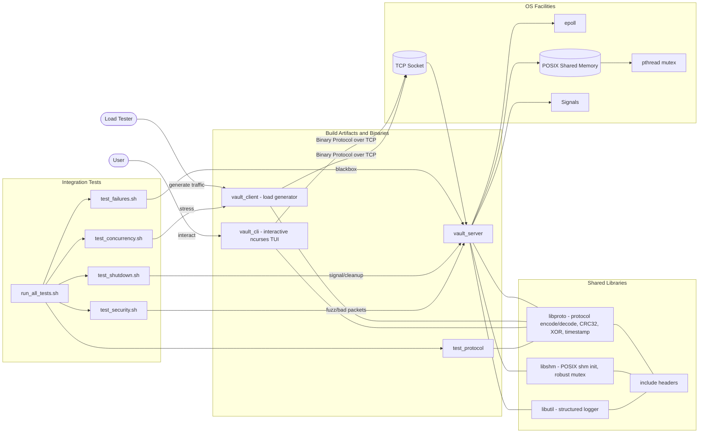
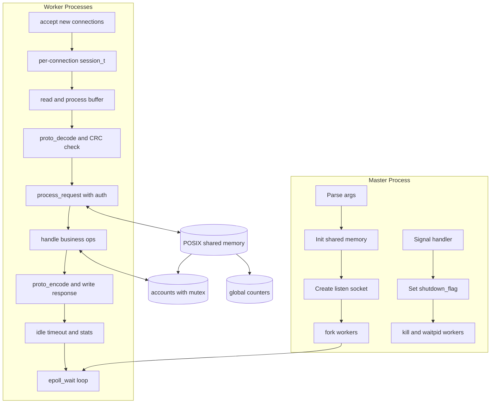
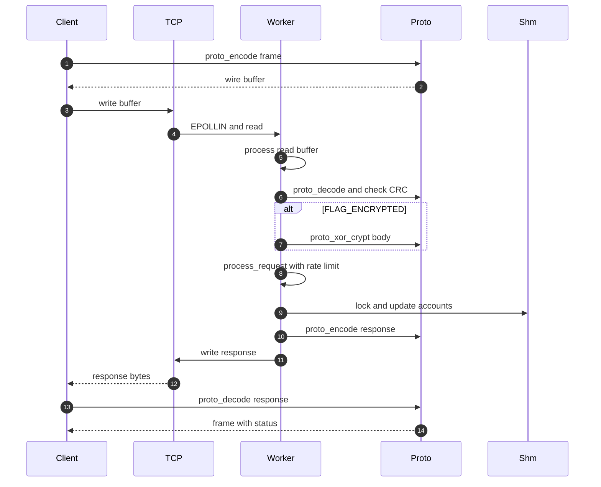
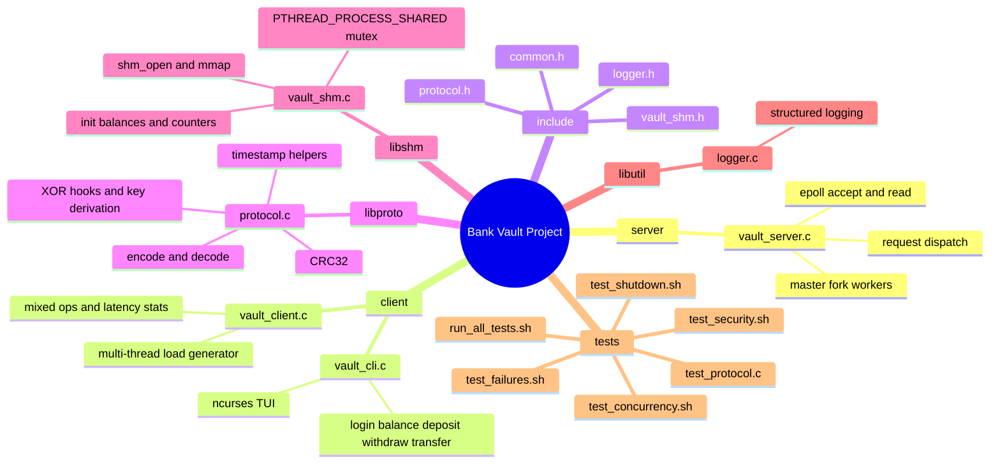

# Bank Vault — Project Architecture (Mermaid)

本檔案提供「整個專案」的架構圖（可直接在 GitHub/Markdown 預覽 Mermaid）。

---

## 1) 全系統總覽（Components + Dependencies）

---

## 2) Server 架構（Master + Workers + Shared State）

---

## 3) 單次請求的資料流（Length-Prefixed Frame + CRC + Dispatch）

---

## 4) Source Tree（模組責任摘要）

